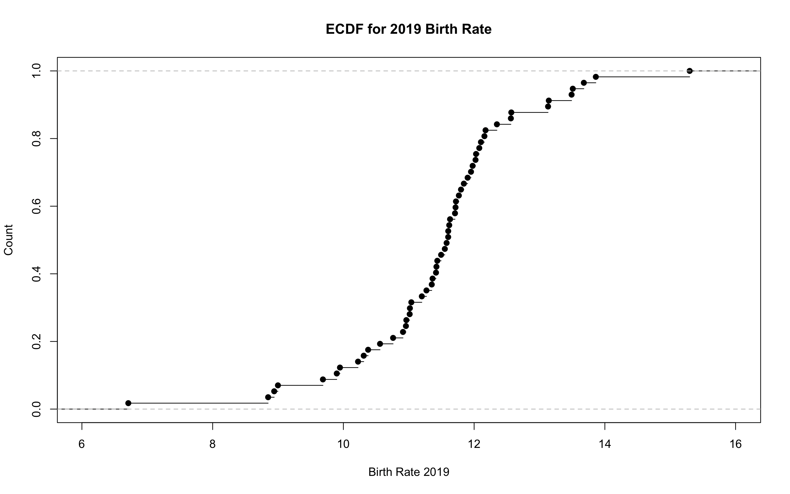

## Part 1 - Using R

## US Census Bureau State Population dataset (NST-EST2019-alldata)

### Dataset: [2](https://www2.census.gov/programs-surveys/popest/datasets/2010-2019/national/totals/nst-est2019-alldata.csv)

This dataset provides yearly data for population, NATURALINC, BIRTH rate, DEATH rate, MIGRATION rate, and much more. The data required for boxplot are birthrate, death-rate, and migration rate. So, the given dataset is used and a new dataset i created by selecting only the required data for the chart. vlookup is applied to get all the three colums under one column which is used for boxplot. The combined data column is named as Year2019.

#### Boxplot: 

Observations: From the boxplot shown above for various states, the increment in rate of birth is most noteworthy, then, at that point, is an increment in death rate and least for migration rate. The rates are positive values from which it tends to be presumed that there is an increment in them in 2019. The distribution of migration rate is all the more yet the middle of it is close to the zero point. What's more, an anomaly is available under -10 point which demonstrates there has been a decrement in the migration rate in one state. The death rate has a middle of under 10 and more than 5, however every one of the values are over zero focuses which tells that there has been an increment in the death rate and its variation is not exactly the migration rate in various states. The rate of birth has a most extreme ascent in rate with a middle of around 11. It has a couple of exceptions, 4 to be explicit who range from around 6 to 16.


#### Histogram: 

Observations: The above plot shows a distribution for rate of birth in the year 2019. For different states, the birth rate is between 6 and 16. The highest birth rate is between 10 and 12. There are two lowest birth rate range i.e., between 6 and 8 & between 14 and 16. The number of bins used is 5. 


#### ECDF: 

Observations: The plot shown above is a ECDF plot for birthrate in the year 2019. For different states, the birth rate is between 6 and 16. It is observed that there is a gradual increase in the birthrate over the year.


### Advantages & Disadvantages:

1. Boxplot plots the three diferent rates for 2019 and we can observe the increment or decrement from the chart.
2. Histogram helps in identifying the distribution of birth rate for different states in 2019. 
3. Advantage of ECDF is that it shows the clear image of the distribution for birth rate in 2019.
4. Disadvantage of boxplot and histogram is that it cannot help us observe the increment or decrement in the birth rate where as ECDF helps us determine if there is an increase or decrease in rate of birth in 2019.


## Part 2

#### Histogram: 

Observations: The above plot shows a distribution for rate of birth in the year 2019. For different states, the birth rate is between 6 and 16. The highest birth rate is between 11 and 12. There are two lowest birth rate range i.e., between 6 and 7 & between 15 and 16. Here, the number of bins used is 10.

#### Histogram: 

Observations: The above plot shows a distribution for rate of birth in the year 2019. For different states, the birth rate is between 6 and 16. The highest birth rate is between 11.8 and 12. There are many lowest birth rate range. Here, the number of bins used is 100.

##### Interesting findings about the data:

In the histogram plot, the number of bins is increased to 10. An increase in the number of bins shows more details. In the next histogram plot, the number of bins is increased to 100. The highest birthrate is 11.8 for 5 different US states and the second-highest is around 11.6 and 11.4 for 4 different US states. 

It is easier to find the increment or decrement by using ecdf plot compared to boxplot and histogram. 


### References:

1. [Boxplot](https://www.statmethods.net/graphs/boxplot.html)
2. [Histogram](https://www.datacamp.com/community/tutorials/make-histogram-basic-r)
3. [ECDDF-1](https://statisticsglobe.com/empirical-cumulative-distribution-function-ecdf-r)
4. [ECDF-2](http://www.sthda.com/english/wiki/ggplot2-ecdf-plot-quick-start-guide-for-empirical-cumulative-density-function-r-software-and-data-visualization)


### Code:

```{r setup, include=TRUE}
knitr::opts_chunk$set(echo = TRUE)


dataset2_plot <- read.csv("/Users/priya/Documents/Data viz/fall21-hw5-priyankavepuri98/Dataset 2.csv")

dataset2 <- read.csv("/Users/priya/Documents/Data viz/fall21-hw5-priyankavepuri98/nst-est2019-alldata.csv")


boxplot(Rates~Year2019,
        main="Distributions for 2019 Birth Rate, Death Rate, and Migration Rate in US",
data=dataset2_plot,
xlab="2019 Distributions",
ylab="Rates",
col="green",
border="black"
)

hist(dataset2$RBIRTH2019, main="Distributions for 2019 Birth Rate",breaks = 5, col="orange",
     xlab="Birth Rate 2019")


plot(ecdf(dataset2$RBIRTH2019), main="ECDF for 2019 Birth Rate", xlab="Birth Rate 2019", ylab="Count")


hist(dataset2$RBIRTH2019, main="Distributions for 2019 Birth Rate", breaks = 10, col="orange", 
     xlab="Birth Rate 2019")

hist(dataset2$RBIRTH2019, main="Distributions for 2019 Birth Rate", breaks = 100, col="orange", 
     xlab="Birth Rate 2019")

