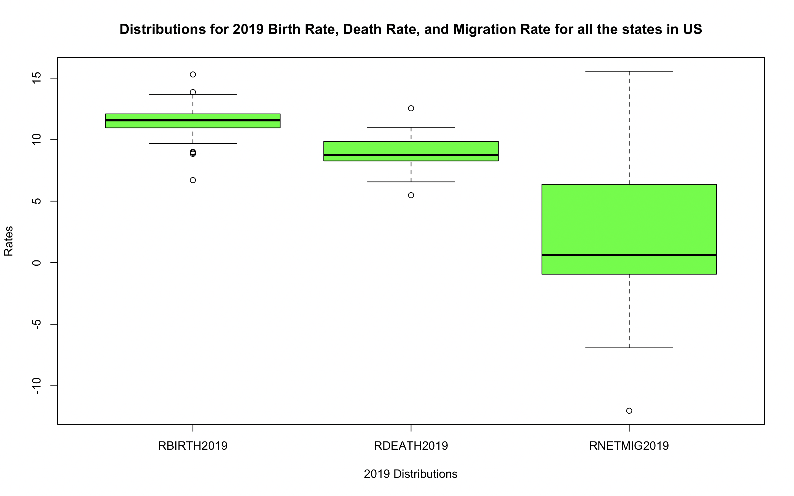
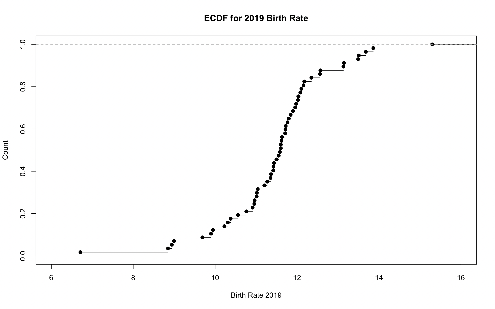

CS625-HW5: Analyzing Data Using Distribution Charts
================
Priyanka Vepuri
11/9/2021

## Part 1 - Using R

## US Census Bureau State Population dataset (NST-EST2019-alldata)

### Dataset: [2](https://www2.census.gov/programs-surveys/popest/datasets/2010-2019/national/totals/nst-est2019-alldata.csv)

This dataset provides yearly data for population, NATURALINC, BIRTH
rate, DEATH rate, MIGRATION rate, and much more. The data required for
boxplot are birthrate, death-rate, and migration rate. So, the given
dataset is used and a new dataset i created by selecting only the
required data for the chart. vlookup is applied to get all the three
colums under one column which is used for boxplot. The combined data
column is named as Year2019.

#### Boxplot: 

Observations: From the boxplot shown above for various states, the
increment in rate of birth is most noteworthy, then, at that point, is
an increment in death rate and least for migration rate. The rates are
positive values from which it tends to be presumed that there is an
increment in them in 2019. The distribution of migration rate is all the
more yet the middle of it is close to the zero point. What’s more, an
anomaly is available under -10 point which demonstrates there has been a
decrement in the migration rate in one state. The death rate has a
middle of under 10 and more than 5, however every one of the values are
over zero focuses which tells that there has been an increment in the
death rate and its variation is not exactly the migration rate in
various states. The rate of birth has a most extreme ascent in rate with
a middle of around 11. It has a couple of exceptions, 4 to be explicit
who range from around 6 to 16.

#### Histogram: 

Observations: The above plot shows a distribution for rate of birth in
the year 2019. For different states, the birth rate is between 6 and 16.
The highest birth rate is between 10 and 12. There are two lowest birth
rate range i.e., between 6 and 8 & between 14 and 16. The number of bins
used is 5.

#### ECDF: 

Observations: The plot shown above is a ECDF plot for birthrate in the
year 2019. For different states, the birth rate is between 6 and 16. It
is observed that there is a gradual increase in the birthrate over the
year.

### Advantages & Disadvantages:

1.  Boxplot plots the three diferent rates for 2019 and we can observe
    the increment or decrement from the chart.
2.  Histogram helps in identifying the distribution of birth rate for
    different states in 2019.
3.  Advantage of ECDF is that it shows the clear image of the
    distribution for birth rate in 2019.
4.  Disadvantage of boxplot and histogram is that it cannot help us
    observe the increment or decrement in the birth rate where as ECDF
    helps us determine if there is an increase or decrease in rate of
    birth in 2019.

## Part 2

#### Histogram: 

Observations: The above plot shows a distribution for rate of birth in
the year 2019. For different states, the birth rate is between 6 and 16.
The highest birth rate is between 11 and 12. There are two lowest birth
rate range i.e., between 6 and 7 & between 15 and 16. Here, the number
of bins used is 10.

#### Histogram: 

Observations: The above plot shows a distribution for rate of birth in
the year 2019. For different states, the birth rate is between 6 and 16.
The highest birth rate is between 11.8 and 12. There are many lowest
birth rate range. Here, the number of bins used is 100.

##### Interesting findings about the data:

In the histogram plot, the number of bins is increased to 10. An
increase in the number of bins shows more details. In the next histogram
plot, the number of bins is increased to 100. The highest birthrate is
11.8 for 5 different US states and the second-highest is around 11.6 and
11.4 for 4 different US states.

It is easier to find the increment or decrement by using ecdf plot
compared to boxplot and histogram.

### References:

1.  [Boxplot](https://www.statmethods.net/graphs/boxplot.html)
2.  [Histogram](https://www.datacamp.com/community/tutorials/make-histogram-basic-r)
3.  [ECDDF-1](https://statisticsglobe.com/empirical-cumulative-distribution-function-ecdf-r)
4.  [ECDF-2](http://www.sthda.com/english/wiki/ggplot2-ecdf-plot-quick-start-guide-for-empirical-cumulative-density-function-r-software-and-data-visualization)

### Code:

``` r
knitr::opts_chunk$set(echo = TRUE)


dataset2_plot <- read.csv("/Users/priya/Documents/Data viz/fall21-hw5-priyankavepuri98/Dataset 2.csv")

dataset2 <- read.csv("/Users/priya/Documents/Data viz/fall21-hw5-priyankavepuri98/nst-est2019-alldata.csv")


boxplot(Rates~Year2019,
        main="Distributions for 2019 Birth Rate, Death Rate, and Migration Rate in US",
data=dataset2_plot,
xlab="2019 Distributions",
ylab="Rates",
col="green",
border="black"
)
```

<!-- -->

``` r
hist(dataset2$RBIRTH2019, main="Distributions for 2019 Birth Rate",breaks = 5, col="orange",
     xlab="Birth Rate 2019")
```

<!-- -->

``` r
plot(ecdf(dataset2$RBIRTH2019), main="ECDF for 2019 Birth Rate", xlab="Birth Rate 2019", ylab="Count")
```

<!-- -->

``` r
hist(dataset2$RBIRTH2019, main="Distributions for 2019 Birth Rate", breaks = 10, col="orange", 
     xlab="Birth Rate 2019")
```

<!-- -->

``` r
hist(dataset2$RBIRTH2019, main="Distributions for 2019 Birth Rate", breaks = 100, col="orange", 
     xlab="Birth Rate 2019")
```

<!-- -->
